# SVRPBench

<p align="center">
  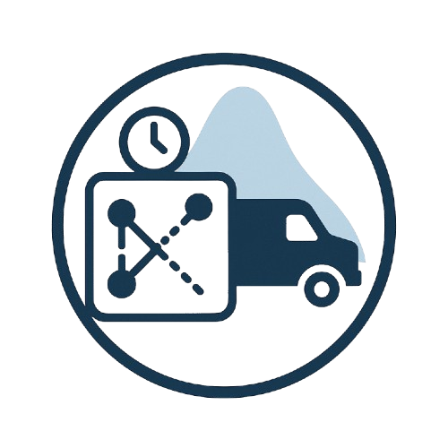
</p>

SVRPBench is an open and extensible benchmark for the Stochastic Vehicle Routing Problem (SVRP). It includes 500+ instances spanning small to large scales (10–1000 customers), designed to evaluate algorithms under realistic urban logistics conditions with uncertainty and operational constraints.

<p align="center">
  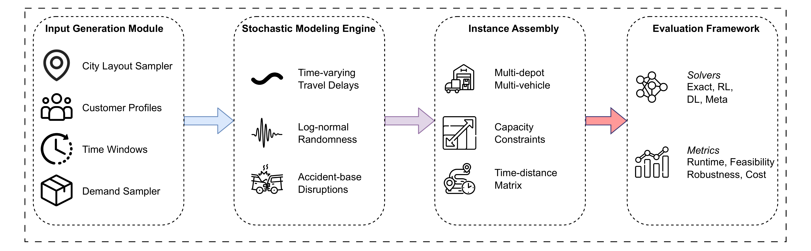
  <br><em>End-to-end pipeline: instance generation → travel-time / time-window sampling → solver → evaluation.</em>
</p>

## Overview

Existing SVRP benchmarks often assume simplified, static environments, ignoring core elements of real-world routing such as time-dependent travel delays, uncertain customer availability, and dynamic disruptions. Our benchmark addresses these limitations by simulating urban logistics conditions with high fidelity:

- Travel times vary based on time-of-day traffic patterns, log-normally distributed delays, and probabilistic accident occurrences
- Customer time windows are sampled differently for residential and commercial clients using empirically grounded temporal distributions
- A systematic dataset generation pipeline that produces diverse, constraint-rich instances including multi-depot, multi-vehicle, and capacity-constrained scenarios

### Realistic city instances

Synthetic instances are calibrated against real urban road networks:

| Abu Dhabi | Michigan | Milan |
|:---:|:---:|:---:|
| 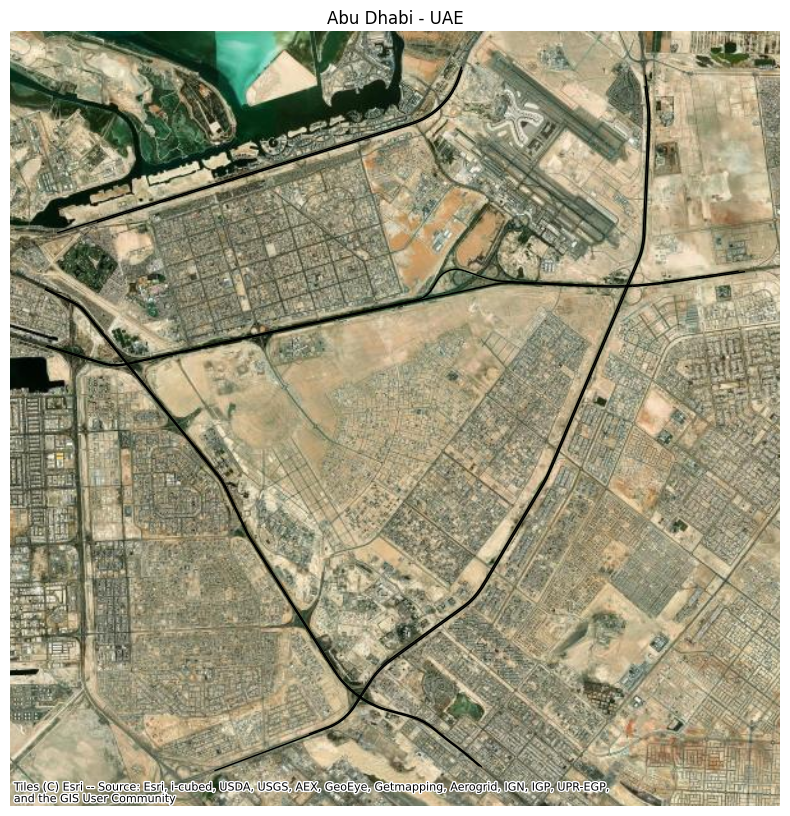 | 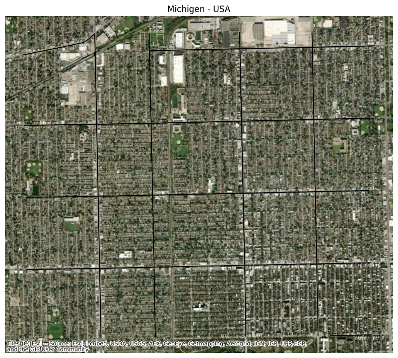 | 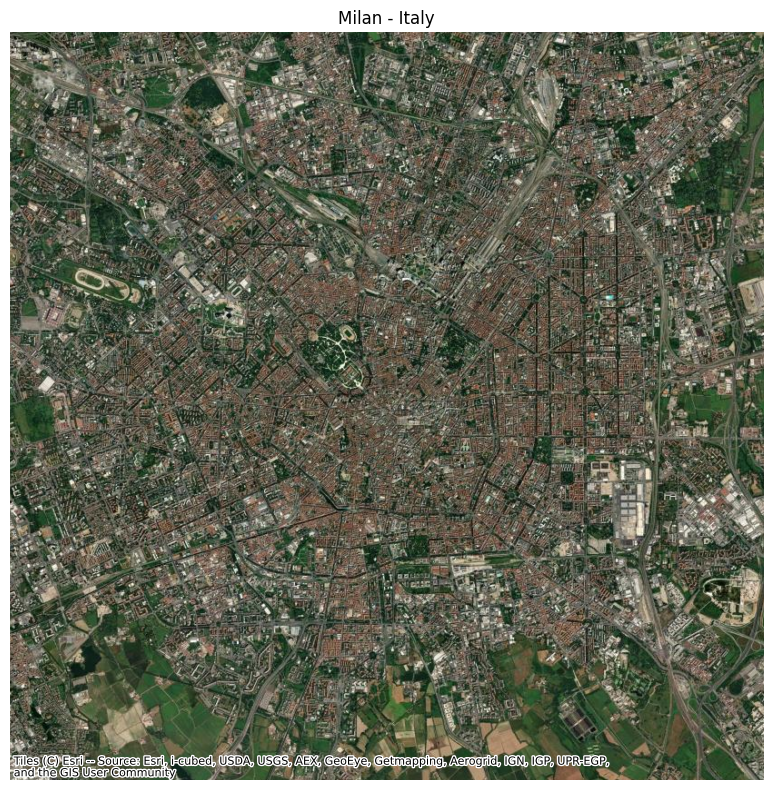 |
| 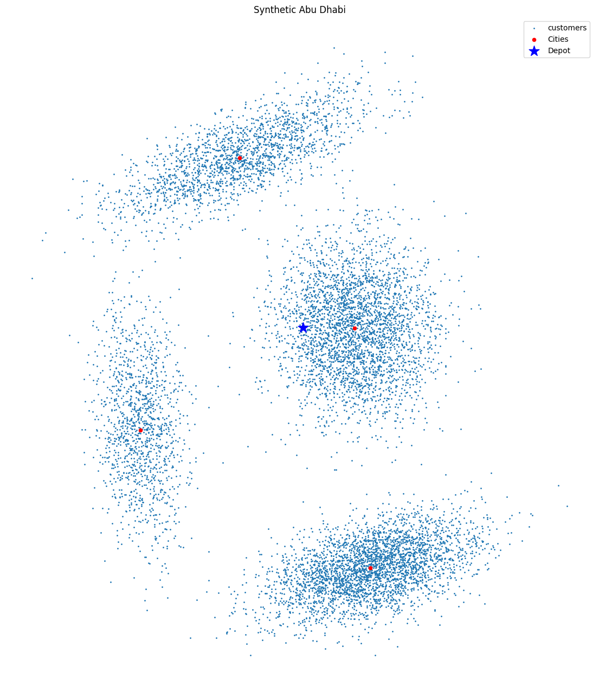 | 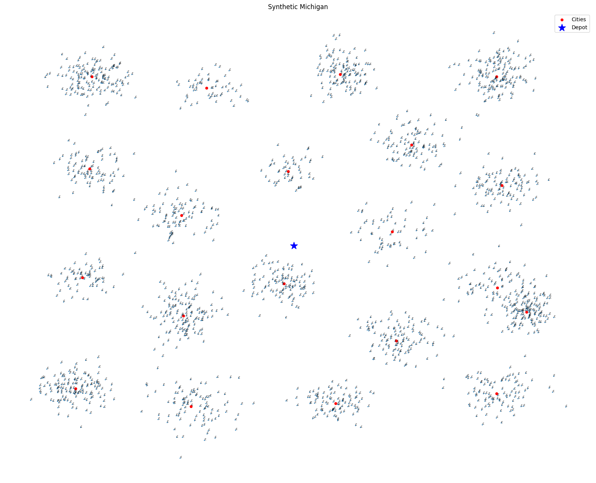 | 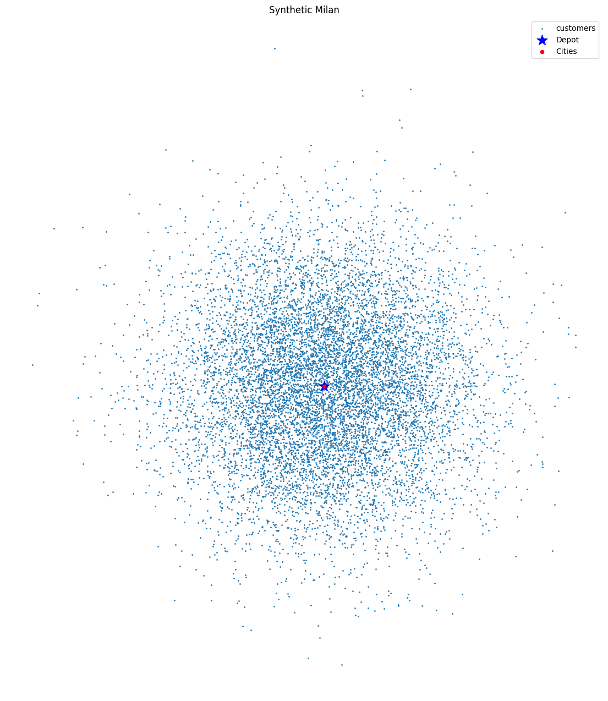 |

## Dataset

The benchmark dataset is available on Hugging Face:
[SVRPBench Dataset](https://huggingface.co/datasets/Yahias21/vrp_benchmark/tree/main)

The dataset includes various problem instances:
- Problem sizes: 10, 20, 50, 100, 200, 500, 1000 customers
- Variants: CVRP (Capacitated VRP), TWCVRP (Time Window Constrained VRP)
- Configurations: Single/Multi-depot, Single/Multi-vehicle

## Supported Algorithms

The benchmark includes implementations of several algorithms:
- OR-tools (Google's Operations Research tools)
- ACO (Ant Colony Optimization)
- Tabu Search
- Nearest Neighbor with 2-opt local search
- Reinforcement Learning models

## Benchmarking Results

<p align="center">
  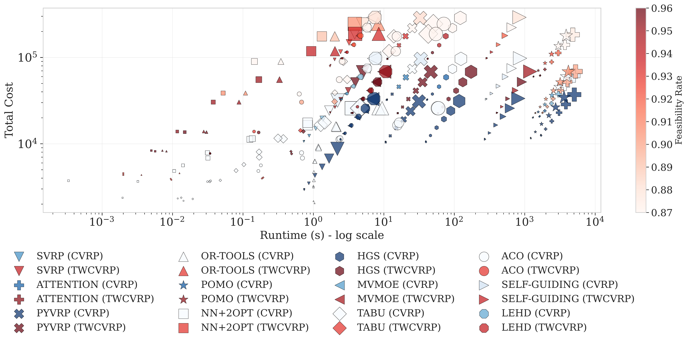
  <br><em>Cost vs. runtime vs. feasibility across solvers.</em>
</p>

<p align="center">
  
  <br><em>How each solver scales as the number of customers grows.</em>
</p>

<p align="center">
  
</p>

### Example solutions

| NN+2opt (10 cust.) | POMO (200 cust.) | REINFORCE (20 cust., TWCVRP) |
|:---:|:---:|:---:|
| 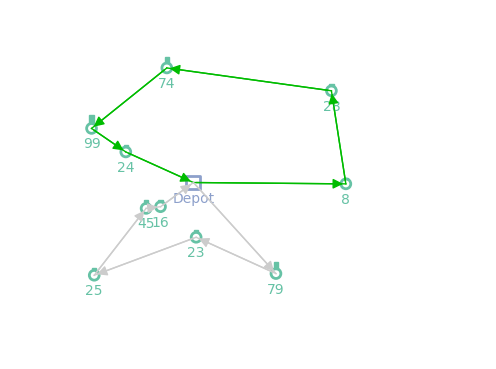 | 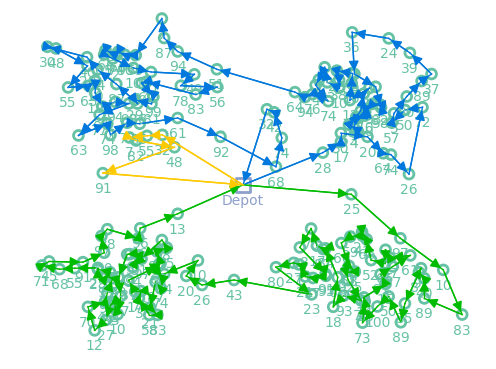 | 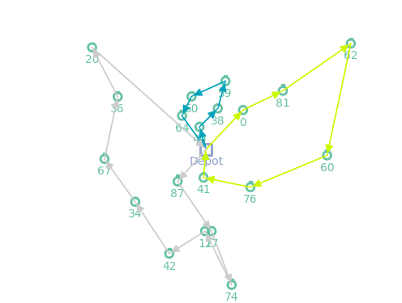 |

## Performance Comparison

### Overall Performance
| Method | Total Cost↓ | CVR (%)↓ | Feasibility↑ | Runtime (s)↓ | Robustness↓ |
|--------|-------------|----------|--------------|--------------|-------------|
| NN+2opt | 40707.5 | 1.6 | 0.984 | 0.697 | 0.1 |
| Tabu Search | 40787.8 | 1.6 | 0.690 | 5.157 | 0.1 |
| ACO | 40566.5 | 1.6 | 0.690 | 11.382 | 0.1 |
| OR-Tools | 40259.3 | 1.6 | 0.984 | 1.940 | 0.1 |
| Attention Model (AM) | 41358.3 | 1.9 | 0.910 | 1.852 | 0.2 |
| POMO | 40650.4 | 1.7 | 0.933 | 1.421 | 0.1 |

### CVRP vs TWCVRP Performance
| Method | CVRP Cost↓ | CVRP CVR↓ | CVRP Feas↑ | CVRP RT↓ | TWCVRP Cost↓ | TWCVRP CVR↓ | TWCVRP Feas↑ | TWCVRP RT↓ | %Δ |
|--------|------------|-----------|------------|----------|--------------|-------------|--------------|------------|-----|
| NN+2opt | 10399.2 | 0.0 | 1.000 | 646.3 | 71015.8 | 3.2 | 0.968 | 747.8 | +582.9 |
| Tabu Search | 10494.1 | 0.0 | 1.000 | 945.1 | 71081.5 | 3.2 | 0.381 | 9368.6 | +577.3 |
| ACO | 10384.9 | 0.0 | 1.000 | 11159.8 | 70748.1 | 3.2 | 0.381 | 11603.6 | +581.3 |
| OR-Tools | 9499.7 | 0.0 | 1.000 | 2328.0 | 71018.8 | 3.2 | 0.968 | 1552.1 | +647.6 |
| Attention Model (AM) | 11235.6 | 0.2 | 0.965 | 1775.4 | 71481.0 | 3.6 | 0.854 | 1929.2 | +536.2 |
| POMO | 10358.7 | 0.1 | 0.987 | 1316.9 | 70942.1 | 3.3 | 0.879 | 1525.3 | +584.8 |

Our benchmark evaluation reveals that OR-Tools achieves the best overall cost (40259.3) with high feasibility (98.4%), while NN+2opt offers the fastest runtime (0.697s). Learning-based methods show competitive performance: POMO balances good solution quality (40650.4), feasibility (93.3%), and runtime (1.421s), while the Attention Model has slightly higher costs (41358.3) and constraint violations (1.9%). Time windows significantly increase problem complexity for all solvers, with cost increases ranging from 536.2% (Attention Model) to 647.6% (OR-Tools). Notably, metaheuristics (Tabu Search, ACO) struggle with feasibility (38.1%) in TWCVRP scenarios, while learning-based approaches demonstrate better resilience to complex constraints despite not achieving the absolute best performance metrics.

## Installation

```bash
pip install -r requirements.txt
```

## Usage

### Command line

```bash
python -m vrp_bench list
python -m vrp_bench solve --solver aco --data path/to/instances.npz --limit 5
```

### Python API

```python
from vrp_bench import load_instances, get_solver, list_solvers
from vrp_bench.evaluation import evaluate

print(list_solvers())                         # ['aco', 'nn2opt', 'or-tools', 'tabu']

instances = load_instances("data/cvrp/vrp_50_1000.npz", limit=5)
solver = get_solver("aco")()
result = evaluate(solver, instances, num_realizations=3)
print(result["aggregate"])
```

### Adding a new solver

```python
from vrp_bench.core import Solver, Instance, Solution, register_solver

@register_solver("my-solver")
class MySolver(Solver):
    def solve(self, instance: Instance, *, num_realizations: int = 1) -> Solution:
        ...  # return a Solution
```

That's it — `python -m vrp_bench solve --solver my-solver ...` will pick it up.

## Architecture

The package is organized around four small abstractions in
[`vrp_bench/core/`](vrp_bench/core/):

- `Instance`  — one VRP problem (locations, demands, capacities, optional time windows).
- `Solution` — routes + standard metrics (cost, runtime, feasibility, CVR, robustness).
- `Solver`   — abstract base class; one method, `solve(instance) -> Solution`.
- `register_solver` — decorator that publishes a solver under a string name.

Built-in solvers live in [`vrp_bench/solvers/`](vrp_bench/solvers/) and are
thin adapters around the original implementations in `vrp_bench/*_solver.py`,
which are kept untouched for reproducibility.

Assets (paper PDF, figures, per-solver visualizations) are documented in
[`assets/README.md`](assets/README.md).

## Features

- Comprehensive evaluation framework for VRP algorithms
- Realistic travel time modeling with time-dependent patterns
- Time window constraints based on empirical distributions
- Support for multi-depot and multi-vehicle scenarios
- Visualization tools for solution analysis
- Extensible architecture for adding new algorithms

## License

This project is licensed under the MIT License - see the LICENSE file for details.

## Citation

If you use this benchmark in your research, please cite:

```bibtex
@misc{svrbench2025,
  author = {Heakl, Ahmed and Shaaban, Yahia Salaheldin and Takáč, Martin and Lahlou, Salem and Iklassov, Zangir},
  title = {SVRPBench: A Benchmark for Stochastic Vehicle Routing Problems},
  year = {2025},
  publisher = {GitHub},
  journal = {GitHub repository},
  howpublished = {\url{https://github.com/yehias21/vrp-benchmarks}}
}
``` 
